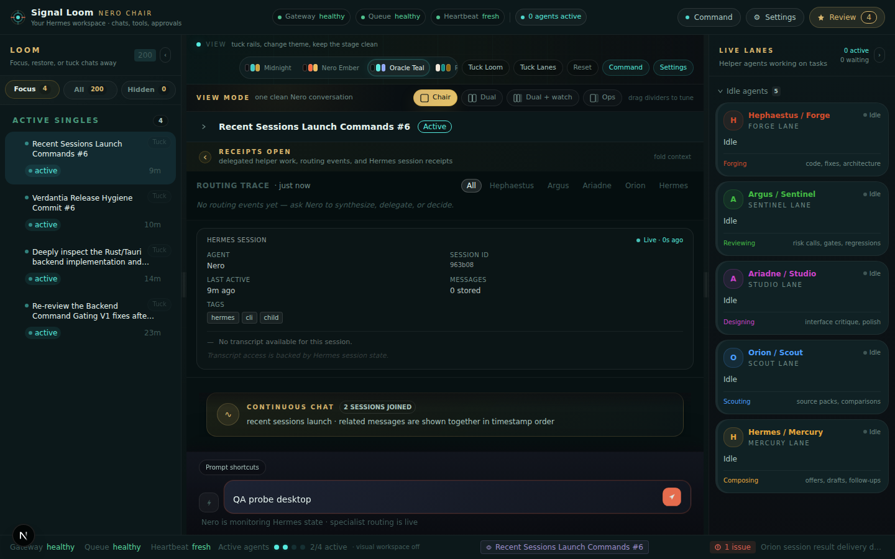
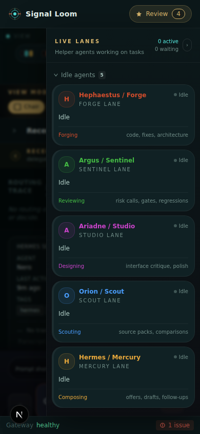

# Signal Loom

Signal Loom is a local web cockpit for operating Hermes/Nero sessions, live agent lanes, approvals, settings, and conversation history from one dense but readable interface.

It is built as a Next.js App Router application and is designed for a local Hermes runtime first: the browser talks to Next.js API routes, and those server-side routes proxy into Hermes/OpenClaw-compatible local services so secrets stay out of the client bundle.

## Screenshots

### Desktop operator shell



### Mobile lane drawer



## What it does

- Shows recent Hermes sessions as a usable thread rail.
- Groups related sessions into continuous conversations where possible.
- Loads transcript history from Hermes/OpenClaw-compatible adapters.
- Provides a central Nero workspace with chair/dual/monitor/operator view presets.
- Keeps routing traces and tool receipts folded by default so the chat stays readable.
- Shows live specialist lanes for the Nero council model:
  - Hephaestus / Forge
  - Argus / Sentinel
  - Ariadne / Studio
  - Orion / Scout
  - Hermes / Mercury
- Provides approval surfaces for human-gated actions and email review flows.
- Provides a Hermes command/settings panel for safe diagnostics, selected config edits, and approval-gated update checks.
- Supports theme switching with persisted, accessible swatches:
  - Midnight Broadcast
  - Nero Ember
  - Oracle Teal
  - Papyrus Dawn
  - Sentry Contrast
- Collapses dense side rails into mobile drawers on compact screens.

## Current design direction

Signal Loom is intentionally not a generic SaaS dashboard. The visual language is a dark operator cockpit: calm reading surfaces, expressive rails, restrained glow, and enough personality to make long work sessions tolerable.

The recent polish pass focused on:

- theme infrastructure and pre-hydration theme bootstrapping
- custom theme swatches instead of a plain select
- persistent hidden/tucked conversation state
- denser but clearer session grouping
- shorter receipts/tool-trace copy
- mobile rail drawers with backdrop behavior
- composer spacing and mobile touch targets
- runtime strip truncation and narrower-status behavior
- README and repository cleanup

## Tech stack

- Next.js 16 App Router
- React 19
- TypeScript
- Tailwind CSS 4
- Zustand for client state
- Framer Motion / Motion for UI animation
- Base UI and shadcn-style local primitives
- Hermes/OpenClaw-compatible local API adapters

## Repository structure

```text
app/
  api/
    hermes/                 Hermes settings, send, and update routes
    openclaw/               Session, health, live, chat, and approval proxy routes
  layout.tsx                Root layout and theme bootstrap
  page.tsx                  App entry point
components/
  agents/                   Live lane cards and email review composer
  approvals/                Human approval cards and panels
  chat/                     Nero workspace, thread panes, messages, composer
  shell/                    Top bar, mission shell, runtime strip, command/settings panels
  threads/                  Session rail and thread list items
  ui/                       Local UI primitives and resize handles
lib/
  hermes/                   Local Hermes state database readers
  openclaw/adapter/         Gateway/session/chat/health adapters
  crm/                      Legacy concept/email gate support types
  conversation-groups.ts    Related-session grouping logic
  store.ts                  Zustand state store
  theme.ts                  Signal Loom theme definitions
  types/                    Shared TypeScript types
docs/
  screenshots/              README screenshots
```

## Prerequisites

- Node.js and npm
- A local Hermes runtime/API server for live data
- A server-side API token in one of:
  - `HERMES_API_KEY`
  - `API_SERVER_KEY`
  - `OPENCLAW_GATEWAY_TOKEN`

By default the app expects Hermes at:

```text
http://127.0.0.1:8642
```

Override it with:

```bash
NEXT_PUBLIC_HERMES_API_URL=http://127.0.0.1:8642
```

The adapter still accepts older OpenClaw environment names while the migration finishes, but new setups should prefer Hermes names.

## Install

```bash
npm install
```

## Development

Start the dev server:

```bash
npm run dev -- --hostname 0.0.0.0 --port 3098
```

Open:

```text
http://localhost:3098
```

In WSL/Windows setups, `localhost` is usually more reliable from the Windows browser than raw IPv4 loopback.

## Production-style local launch

Build first:

```bash
npm run build
```

Then run with a server-side token:

```bash
HERMES_API_KEY=your-local-token ./run.sh 3098
```

`run.sh` deliberately does not store credentials. Do not commit `.env` files or local Hermes state.

## Verification commands

Use these before committing or pushing:

```bash
npm run typecheck
npm run lint
npm run build
```

The current build may emit a Turbopack/NFT warning traced through `next.config.ts` and `app/api/openclaw/live/route.ts`. It does not currently fail compilation, but it is still worth cleaning in a future pass.

## Browser QA checklist

For layout or shell changes, verify at minimum:

- desktop: `1440x900`
- mobile: `390x844`
- no console errors or page errors
- no hydration mismatch text/overlay
- `document.documentElement.scrollWidth - document.documentElement.clientWidth === 0`
- no duplicate IDs
- no unnamed visible interactive controls
- theme swatch click updates `document.documentElement.dataset.signalTheme`
- theme choice persists in `localStorage`
- composer typing enables the send button
- mobile `Open Loom` and `Open Lanes` controls open overlay drawers
- outside/backdrop click closes the active mobile drawer

## API notes

The browser should not call Hermes/OpenClaw directly with secrets. The intended path is:

```text
Browser -> Next.js API route -> local Hermes/OpenClaw service
```

Important local routes:

- `GET /api/openclaw/sessions`
- `GET /api/openclaw/sessions/history?sessionKey=...`
- `GET /api/openclaw/health`
- `GET /api/openclaw/live`
- `POST /api/openclaw/chat`
- `POST /api/openclaw/chat/stream`
- `POST /api/openclaw/approvals/resolve`
- `GET /api/hermes/settings`
- `POST /api/hermes/settings`
- `POST /api/hermes/update`

The Hermes settings route is local-operator tooling. Treat it as trusted-local only; do not expose this app publicly without adding authentication and reviewing the settings/update endpoints.

## Safety boundaries

Signal Loom is a local operator cockpit, not a public SaaS app. Before public deployment, add:

- authentication
- CSRF protection for mutation routes
- stricter server-side authorization around config writes and update actions
- audit logging for settings changes
- redaction around config display
- deployment-specific environment validation

## Cleanup policy

The repo intentionally excludes local agent/runtime artifacts:

- `.hermes/`
- `output/`
- `.verification-screenshots/`
- `.next/`
- environment files
- TypeScript build info

The committed screenshots under `docs/screenshots/` are curated README assets, not transient QA output.

## Useful scripts

```bash
npm run dev        # start Next.js dev server
npm run typecheck  # TypeScript verification
npm run lint       # ESLint
npm run build      # production build
./run.sh 3098      # local production-style launch after build
```

## Status

Signal Loom is actively evolving as Nero's local operator interface. The current version is usable for local Hermes session review and cockpit-style operation, but public deployment still requires the security hardening listed above.
